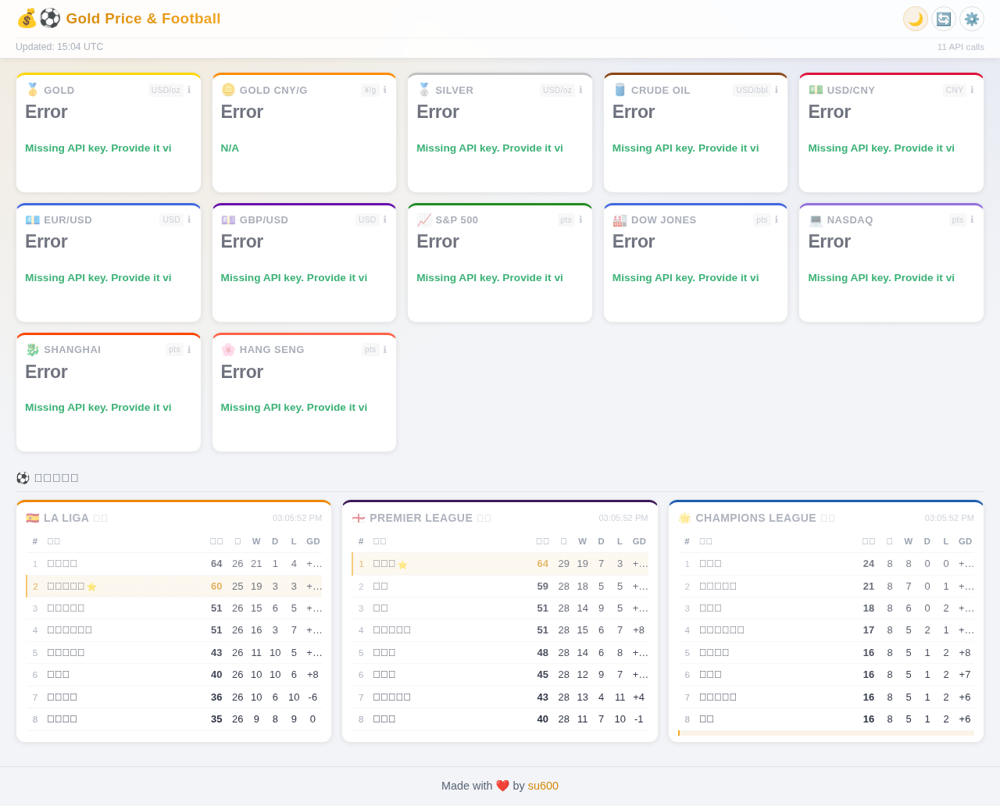
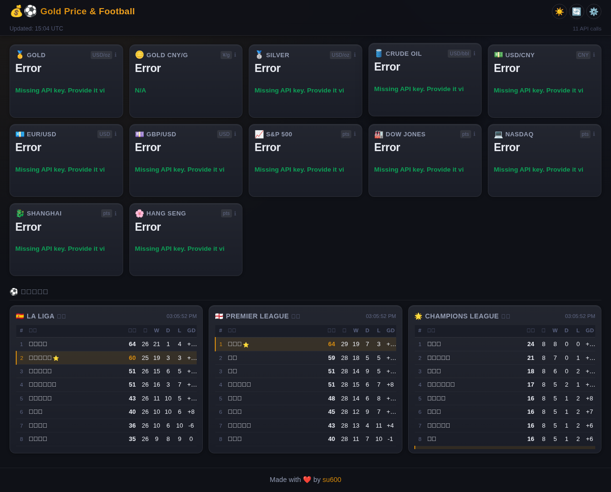
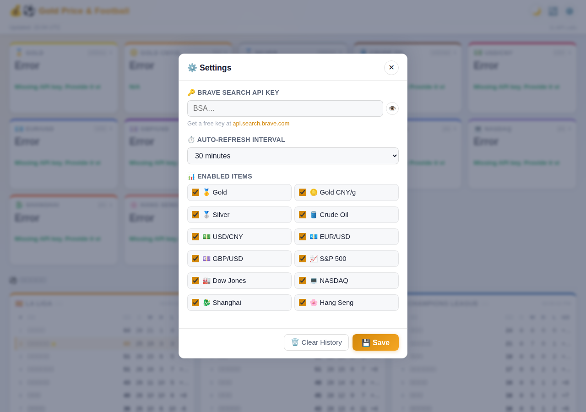
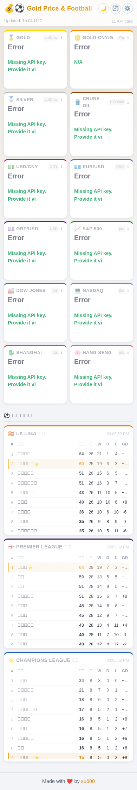

# 💰⚽ Gold Price & Football

A **Progressive Web App (PWA)** for real-time financial data and live football standings — including gold, silver, crude oil, exchange rates, US stocks, Shanghai Composite, Hang Seng, and league tables for La Liga, Premier League, and UEFA Champions League.

Financial data is fetched from multiple sources in priority order: **GoldPrice.org** (gold/silver spot) → **新浪财经 Sina Finance** (all symbols, no API key, works in China) → **Yahoo Finance** (fallback) → **Brave Search API** (optional last-resort fallback).

Key features:
- 🥇 **Gold, Silver, Crude Oil** spot prices
- 💵 **USD/CNY, EUR/USD, GBP/USD** exchange rates
- 📈 **S&P 500, Dow Jones, NASDAQ** US indices
- 🐉 **Shanghai Composite (SSE)** and 🌸 **Hang Seng (HSI)** Asian indices
- 🇨🇳 Automatic **gold price in CNY/gram** conversion
- ⚽ **Football standings** — La Liga 🇪🇸, Premier League 🏴󠁧󠁢󠁥󠁮󠁧󠁿, and UEFA Champions League 🌟 (via Dongqiudi)
- 📊 **Trend sparklines** on every card + full interactive chart on tap
- 🧩 **Two-row card layout** with smooth horizontal scrolling for dense market overviews
- 📐 **Optimized trend chart sizing** for better readability on both mobile and desktop
- 🌐 **Works without any API key** — Sina Finance & GoldPrice.org require no credentials; Brave API key is optional (enables a last-resort search fallback)
- ⚙️ **Optional Brave API key** — stored locally in `localStorage`, sent only to your own server (as a request header) which forwards it to the Brave API; never placed in URLs or server logs
- ⏱️ Configurable **auto-refresh** interval (5 min → 1 hr)
- 📱 **Installable PWA** — works offline (serves cached UI)
- 🎨 **Premium light/dark UI** with responsive spacing, polished cards, and mobile/PC adaptive styling

---

## Screenshots

| Light Mode (Desktop) | Dark Mode (Desktop) |
|:---:|:---:|
|  |  |

| Settings Panel | Mobile View (with Football Standings) |
|:---:|:---:|
|  |  |

---

## Quick Start

### Prerequisites
- Node.js ≥ 18
- (Optional) A free [Brave Search API key](https://api.search.brave.com) — only needed if you want Brave Search as a last-resort fallback
- 科学上网 (required for Yahoo Finance; **not** required for Sina Finance or GoldPrice.org)

### Installation

```bash
git clone https://github.com/su600/Golden-Price.git
cd Golden-Price
npm install
npm start
```

Open **http://localhost:3000** in your browser.

On first launch the settings panel opens automatically. Sina Finance and GoldPrice.org work without any credentials. If you have a Brave Search API key, paste it in settings to enable search-based fallback.

### Docker 部署

**前提条件：** 已安装 [Docker](https://docs.docker.com/get-docker/)

**构建镜像**

```bash
docker build -t golden-price .
```

**运行容器（映射到宿主机 7000 端口）**

```bash
docker run -d --name golden-price -p 7000:7000 golden-price
```

访问 **http://localhost:7000** 即可打开应用。

**常用命令**

```bash
# 查看容器状态
docker ps

# 查看日志
docker logs -f golden-price

# 停止容器
docker stop golden-price

# 删除容器
docker rm golden-price
```

> 镜像基于 `node:18-alpine`，体积约 60–70 MB，无多余依赖。

### Install as PWA (Mobile)

1. Open `http://<your-server>:7000` in Chrome/Safari on your phone.
2. Chrome → "Add to Home screen"; Safari → Share → "Add to Home Screen".

---

## Architecture

```
Gold-Price/
├── server.js          # Express server — proxies external APIs (solves CORS)
├── package.json
├── lib/
│   └── standings.js   # Football standings parser (Dongqiudi HTML → JSON)
└── public/
    ├── index.html     # App shell
    ├── styles.css     # Responsive light/dark theme (mobile + desktop)
    ├── app.js         # Data fetching, parsing, charts, history, standings
    ├── manifest.json  # PWA manifest
    ├── sw.js          # Service worker (offline caching)
    └── icons/
        └── icon.svg   # App icon
```

### Server-side API endpoints

| Endpoint | Data source | Auth required |
|----------|------------|---------------|
| `GET /api/goldprice` | goldprice.org — real-time XAU/XAG spot | None |
| `GET /api/sina/quotes` | hq.sinajs.cn — bulk quotes for all symbols | None |
| `GET /api/quote/:symbol` | Yahoo Finance — 5-day chart & latest price | None |
| `GET /api/standings/:league` | m.dongqiudi.com — league table (`laliga`, `premierleague`, `ucl`) | None |
| `GET /api/search?q=…` | Brave Search API — structured web results | `X-Api-Key` header |
| `GET /api/ping?host=…` | Connectivity probe (sina / yahoo / brave) | None |

### Client-side data-source priority

For each financial item the browser tries sources in this order and uses the first successful result:

1. **GoldPrice.org** (gold & silver only) — accurate real-time spot price, no key needed
2. **Sina Finance** — single bulk request for all 11 symbols, no key needed, works in mainland China
3. **Yahoo Finance** — widely available fallback; may be blocked in China
4. **Brave Search API** — last-resort search-based extraction; requires an optional API key

The browser talks only to the server's proxy endpoints (`/api/*`).  
The Express server reads your Brave API key from the `X-Api-Key` request header and forwards it to `api.search.brave.com` as the `X-Subscription-Token` header.  
**Your API key is never placed in URLs or server logs.**

---

## Environment Variables

| Variable | Default | Description |
|----------|---------|-------------|
| `PORT`   | `3000`  | HTTP port for local development; the Dockerfile overrides this to `7000` |

---

## Data Parsing

- **GoldPrice.org** returns structured JSON; **Sina Finance** upstream (`hq.sinajs.cn`) returns JavaScript-like `var hq_str_...` strings which the server parses and exposes as JSON via `/api/sina/quotes`, where prices are read from well-known fields.
- **Yahoo Finance** (`/v8/finance/chart`) returns `meta.regularMarketPrice` and `meta.regularMarketChangePercent`.
- **Brave Search** (fallback only) — prices are extracted from search result snippets using item-specific regex patterns with a valid-range guard.

Historical data points (up to 48 per metric) are stored in `localStorage` for sparkline and trend charts.

---

## UI Notes (Latest)

- Cards are displayed in a **fixed two-row layout** and scroll horizontally when needed.
- The trend chart modal uses a **responsive container** (`clamp`-based height) for balanced chart proportions.
- The page is tuned for **mobile and desktop** with breakpoint-based spacing, typography, and card widths.
- Visual polish includes a soft gradient background, glass-like sticky header, and refined hover/focus states.
- The **football standings section** appears below the financial cards and shows live league tables for La Liga, Premier League, and Champions League.

---

## Football Standings

Standings data is proxied from [东球迷 Dongqiudi](https://m.dongqiudi.com) — no API key required. The server fetches the mobile HTML page, extracts the embedded `window.__INITIAL_STATE__` JSON, and returns normalized rows to the client.

| League | `league` param |
|--------|---------------|
| 🇪🇸 La Liga | `laliga` |
| 🏴󠁧󠁢󠁥󠁮󠁧󠁿 Premier League | `premierleague` |
| 🌟 UEFA Champions League | `ucl` |

Each row includes: position, team name, logo URL, points, wins, draws, losses, games played, and goal difference.

